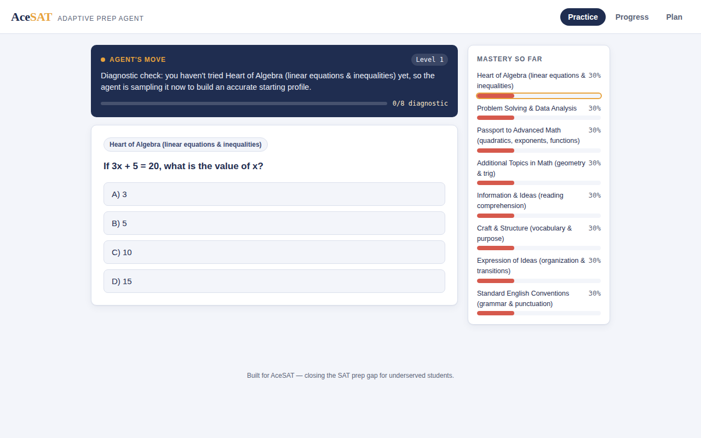
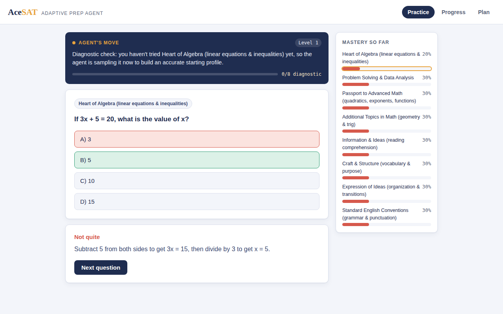
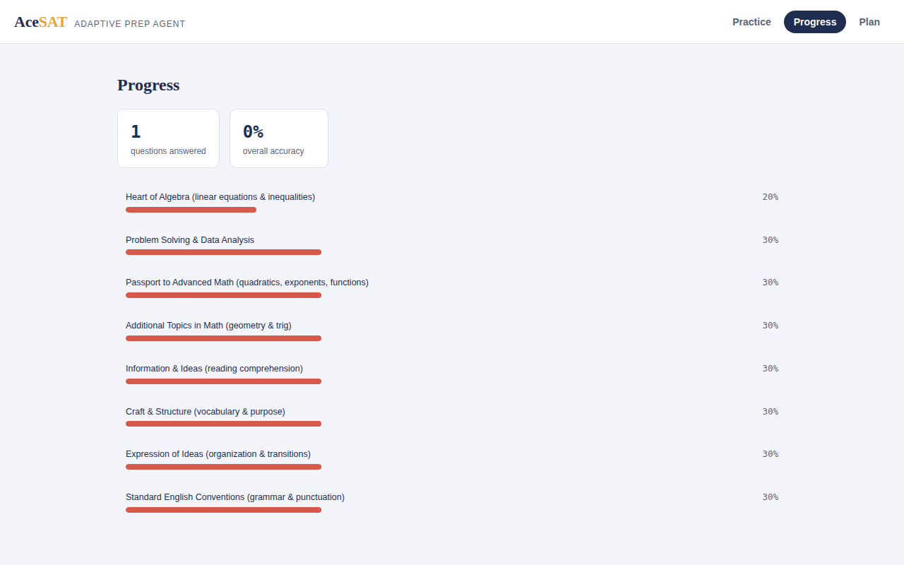
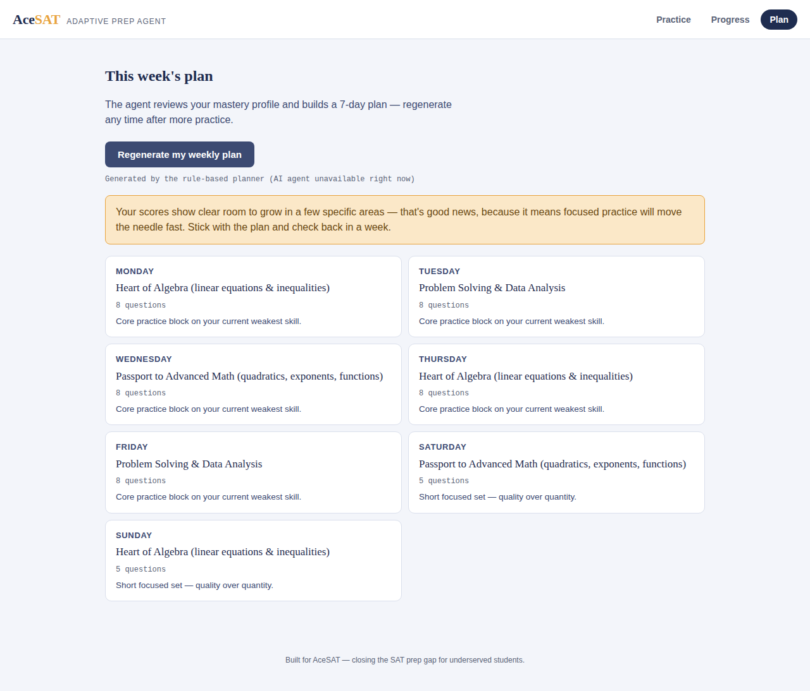
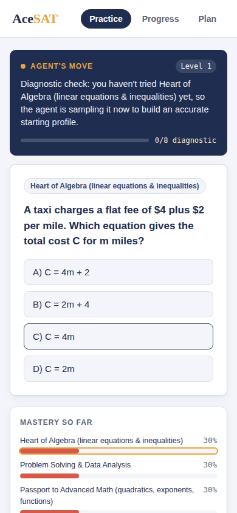

# AceSAT — Adaptive SAT Prep Agent

A working prototype built for the AceSAT hackathon. It's an SAT prep
**agent**, not a chatbot: it runs a short diagnostic, decides what a
student should practice next and tells them why, re-teaches a concept the
moment it detects real confusion, and writes a personalized weekly study
plan on its own.



## Why this isn't "just a chatbot"

A chatbot waits to be asked something. Every core action in this app is
initiated by the agent, not the student:

| Agent decision | Where it happens |
|---|---|
| Runs a full diagnostic across all 8 SAT skill domains before doing anything else | `select_next_question()` in `app.py` |
| Picks the next question by weighting toward the student's weakest, least-practiced skill (with a small exploration rate so no skill goes stale) | `select_next_question()` |
| Adjusts question difficulty up or down per skill based on a streak rule | `update_mastery()` |
| Detects 3-in-a-row mistakes on a skill and interrupts normal practice to re-teach the concept *before* the next question | `record_attempt` route + `explanation_agent()` |
| Reviews the entire mastery profile and writes a 7-day study plan with daily focus areas | `build_study_plan()` |
| Proactively nudges the student about a neglected weak skill | `check_in()` |

The student never picks a skill, a difficulty, or a chapter. The agent
does, every time, and shows its reasoning in the "Agent's move" panel so
it's auditable rather than a black box.

## How the agent actually works

**1. Diagnostic phase.** A brand-new student is served exactly one
question per skill domain (8 total) before the system adapts. This
avoids the cold-start problem of guessing what's weak from zero data.

**2. Mastery model.** Each skill has a live mastery score in `[0,1]`,
updated after every answer with a simple exponential rule (`+= (1-score)
* 0.35` on correct, `-= score * 0.35` on incorrect). It's a lightweight
stand-in for Bayesian Knowledge Tracing — easy to explain to a judge in
one sentence, and easy to swap for a more sophisticated model later.

**3. Adaptive selection.** Once the diagnostic is done, the agent weights
each skill by `(1.05 - mastery)^2`, so the weakest skill is overwhelmingly
likely to be picked next, with a small chance (12%) of practicing a
stronger skill to keep it warm. Difficulty per skill rises after two
correct answers in a row and drops after a miss.

**4. Scaffold trigger.** If a student misses the *same skill* three times
in a row, the agent doesn't just serve another question — it calls Claude
(or a fallback) for a short re-teach of the underlying concept before
continuing. This is the clearest "takes initiative" moment in the app.

**5. Weekly plan agent.** On request, the agent hands its entire mastery
profile to Claude and asks for a structured 7-day plan (focus skill +
question count + note per day, plus a motivational summary), parsed as
JSON. If the API is unavailable or returns malformed JSON, a deterministic
rule-based planner (sort skills by weakness, distribute practice across
the week) produces an equivalent plan instantly — the UI labels which one
generated the plan it's showing.

**6. Check-in nudges.** A lightweight rule checks for any practiced skill
sitting below 45% mastery and surfaces a banner suggesting a focused
warm-up. This is the hook point for a real push/SMS/email integration in
production (see Future Work).

## Screenshots

| Diagnostic in progress | Feedback + live mastery update |
|---|---|
|  |  |

| Progress dashboard | Agent-generated weekly plan |
|---|---|
|  |  |

| Mobile view |
|---|
|  |

## Tech stack & why it's accessible

- **Backend:** Flask + SQLite (stdlib `sqlite3`, no external DB service to
  provision). Runs comfortably on a low-end machine or a free-tier server.
- **Frontend:** vanilla HTML/CSS/JS — no framework, no build step, no CDN
  dependency. The entire page weighs a few dozen KB, so it loads fast on
  school wifi or a limited data plan. Mobile-first, large tap targets,
  visible keyboard focus, respects `prefers-reduced-motion`.
- **AI calls degrade gracefully.** Every Claude-dependent feature
  (explanations, weekly plan) has a deterministic fallback. If the API key
  is missing, the network is down, or a call is slow, the app still works
  end-to-end — it just uses rule-based text instead of generated text.
  This matters a lot for students on unreliable connections.
- **No login system.** A student just types a name to start or resume —
  no email, no password, no setup friction for a school computer lab.

## Deploying a live demo (Render, free tier)

This repo is ready to deploy as-is — `Procfile` and `gunicorn` are already
included.

1. Push this repo to GitHub (see below if you haven't yet).
2. Go to [render.com](https://render.com) → sign up free (no card required)
   → **New +** → **Web Service** → connect your GitHub account → select
   this repo.
3. Render auto-detects Python. Set:
   - **Build command:** `pip install -r requirements.txt`
   - **Start command:** `gunicorn app:app`
4. (Optional) Under **Environment**, add `ANTHROPIC_API_KEY` to enable
   AI-generated explanations and study plans. Without it, the app still
   works fully on its rule-based fallbacks.
5. Click **Create Web Service**. First deploy takes a couple of minutes;
   you'll get a public URL like `https://acesat-xxxx.onrender.com`.

**Two things worth knowing before a demo:**
- The free instance spins down after 15 minutes idle, and the next
  request takes about a minute to wake it back up. Open your link a
  minute or two before you actually present.
- SQLite on Render's free tier resets on redeploy (not on every wake-up,
  just on a fresh deploy). Fine for a hackathon demo; a real deployment
  would move to Render's free Postgres instead.

## Pushing this repo to GitHub

```bash
cd acesat-adaptive-prep
git remote add origin https://github.com/<your-username>/<your-repo>.git
git branch -M main
git push -u origin main
```

(If you unzipped this project, it already has one git commit ready to go
— you just need to add your remote and push.)

## Setup

```bash
# 1. Clone and enter the project
git clone <this-repo-url>
cd acesat-adaptive-prep

# 2. Install dependencies
pip install -r requirements.txt

# 3. (Optional) enable AI-generated explanations and study plans
cp .env.example .env
# edit .env and add your ANTHROPIC_API_KEY
export $(grep -v '^#' .env | xargs)   # or use python-dotenv / your shell's method

# 4. Run it
python3 app.py
# -> AceSAT Adaptive Prep running on http://localhost:5000
```

Open `http://localhost:5000`, type any name, and start practicing. The
database (`data/acesat.db`) is created automatically on first run.

**Running without an API key works fine** — you'll see a note in the
console, and the app uses its rule-based fallbacks for explanations and
the weekly plan instead of Claude-generated text.

## Project structure

```
acesat-adaptive-prep/
├── app.py                  # Flask app + all agent logic (see comments at top)
├── generate_questions.py   # builds data/questions.json (original question bank)
├── data/
│   └── questions.json      # 40 original SAT-style questions, 8 skill domains
├── templates/
│   └── index.html          # single-page app shell
├── static/
│   ├── style.css           # design system (tokens at the top of the file)
│   └── app.js               # frontend logic, talks to the Flask API
├── docs/screenshots/        # used in this README
├── requirements.txt
├── .env.example
└── WRITEUP.md               # one-page submission write-up
```

## API reference (for anyone extending this)

| Method & path | Purpose |
|---|---|
| `POST /api/students` | Create or resume a student by name |
| `GET /api/next-question?student_id=` | Agent picks and returns the next question + its reasoning |
| `POST /api/answer` | Submit an answer; returns correctness, explanation, scaffold flag, updated mastery |
| `GET /api/dashboard?student_id=` | Full mastery profile + accuracy + history |
| `POST /api/study-plan` | Agent generates (or falls back to) a 7-day plan |
| `GET /api/check-in?student_id=` | Returns a nudge message or `null` |

## Known limitations & future work

- **Question bank is a 40-question demo set**, written from scratch for
  this hackathon (not sourced from College Board). A production version
  would need a much larger, professionally vetted bank — Khan Academy's
  open content or a licensed SAT question API would be the natural next
  step.
- **Mastery model is intentionally simple** (an exponential update) so a
  judge can verify the logic in thirty seconds. A real deployment would
  benefit from full Bayesian Knowledge Tracing or an IRT-based model.
- **Reminders are in-app only.** The `check_in()` function is already
  structured so a cron job could call it daily per student and pipe the
  result into Twilio (SMS) or an email service for true push reminders —
  exactly the kind of integration underserved schools with shared devices
  would need (a nudge that reaches a student's phone, not just an open
  browser tab).
- **Single-process SQLite** is fine for a hackathon demo; a multi-school
  deployment would move to Postgres and add real authentication.
